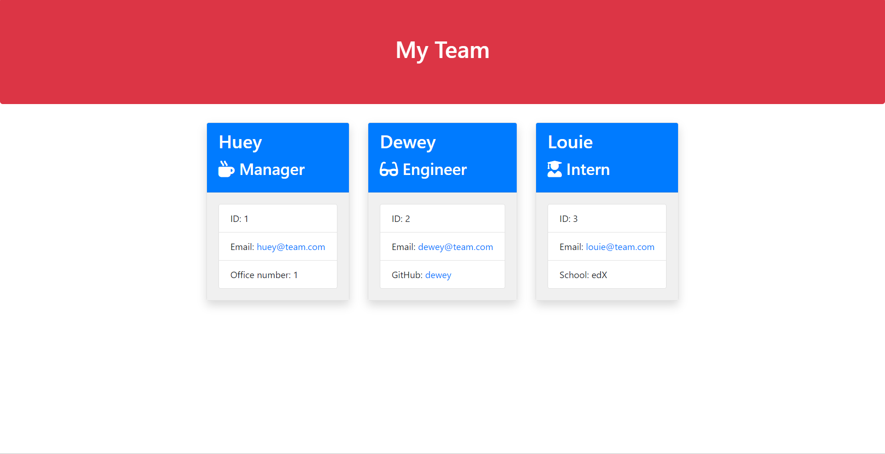

# Team Profile Generator

## Overview

This Node.js command-line application is designed to streamline the process of generating an HTML webpage with summaries for each member of a software engineering team. It takes in information about team members and produces a visually appealing webpage showcasing their details.



## Features

### Information Input:

- Collects data about each team member using the [Inquirer package](https://www.npmjs.com/package/inquirer).
  - Asks for general information such as name, email, and ID.
  - Gathers role-specific information (e.g., GitHub username for engineers).

### HTML Output:

- Generates a sample HTML file that displays concise summaries for each team member.

### Tested Functionality:

- Comprehensive test suite using the [Jest package](https://www.npmjs.com/package/jest) to ensure the reliability and correctness of every code segment.

### Class Structure:

- Includes `Employee`, `Manager`, `Engineer`, and `Intern` classes to represent different roles within the team.

## Tech Stack

- JavaScript
- Node.js
- Inquirer
- Jest

## Getting Started

1. **Clone the repository**

   ```console
   git clone https://github.com/borregaio/team-profile-generator
   ```

2. **Install dependencies**

   ```console
   npm install
   ```

3. **Open the index.js file in your terminal**

   ```console
   cd team-profile-generator
   node index.js
   ```

4. **Input Information:**

   - Follow the prompts to input information for each team member.

5. **HTML Output:**

   - Once all team members' information is provided, the application will generate an HTML file in the `output` directory.

6. **Review the Output:**
   - Open the generated HTML file in a web browser to view the team profile.

## Testing

Make sure to run the provided tests with `Jest` to ensure that every part of your code functions correctly. Use the following command to run the tests:

```console
npx jest
```

## Steps Followed

Follow these steps to use and contribute to the Team Profile Generator:

1. **Create Classes for Each Employee:**

   - Implement the `Employee`, `Manager`, `Engineer`, and `Intern` classes to represent different roles within the team. Each class should inherit from the base `Employee` class.
        ```javascript
        class Employee {
            constructor(name, id, email) {
            this.name = name;
            this.id = id;
            this.email = email;
            }

            getName() {
            return this.name;
            }

            getId() {
            return this.id;
            }

            getEmail() {
            return this.email;
            }

            getRole() {
            return "Employee";
            }
        }

        module.exports = Employee;
        ```

2. **Create Questions to be Prompted for Every Employee with Inquirer:**

    - Define a set of questions using the [Inquirer package](https://www.npmjs.com/package/inquirer) to prompt users for information about each team member. Customise questions based on the role (e.g., additional questions for engineers).
        ```javascript
        const initialQuestions = [
            {
                type: 'input',
                name: 'managerName',
                message: 'What is the team manager\'s name?',
                validate: input => (input !== '') ? true : 'Name is required',
            },
            {
                type: 'input',
                name: 'managerId',
                message: 'What is the team manager\'s ID?',
                validate: input => (input !== '') ? true : 'ID is required',
            },
            {
                type: 'input',
                name: 'managerEmail',
                message: 'What is the team manager\'s email?',
                validate: input => (input !== '') ? true : 'Email is required',
            },
            {
                type: 'input',
                name: 'managerOfficeNumber',
                message: 'What is the team manager\'s office number?',
                validate: input => (input !== '') ? true : 'Office number is required',
            },
            {
                type: 'list',
                name: 'teamMemberType',
                message: 'Which type of team member would you like to add?',
                choices: ['Engineer', 'Intern', 'I don\'t want to add any more team members'],
            },
        ];
        ```

3. **Add New Employee Answers Constructor to the Employees Array:**

   - Utilise the answers obtained from Inquirer prompts to create instances of the respective employee classes. Ensure that the information is added to an array (e.g., `employees`) for further processing.
        ```javascript
            function promptQuestions(questions) {
            inquirer.prompt(questions)
                .then(answers => {
                    if (questions === initialQuestions) {
                        // Create an instance of the Manager class using the constructor and push it to the employees array
                        const manager = new Manager(
                            answers.managerName,
                            answers.managerId,
                            answers.managerEmail,
                            answers.managerOfficeNumber
                        );
                        employees.push(manager);
        ```

4. **Render HTML File with the Employee Array Items:**

   - Develop a function to dynamically generate HTML content using the information stored in the `employees` array. Utilise template literals or a templating engine to create a professional-looking layout.
        ```javascript
        const renderedHTML = render(employees);
        ```

5. **Save HTML File to the Output Folder:**

   - Implement functionality to save the generated HTML file to the `output` folder.
        ```javascript
        fs.writeFileSync(outputPath, renderedHTML);
        ```

6. **Generate Sample HTML File:**

   - Run the application with `node index.js` and input information for each team member. Once completed, review the sample HTML file generated in the `output` folder.
